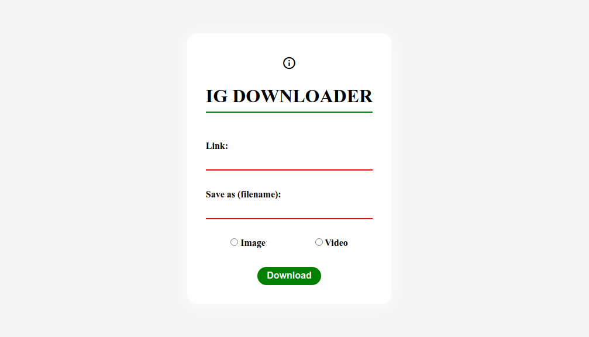
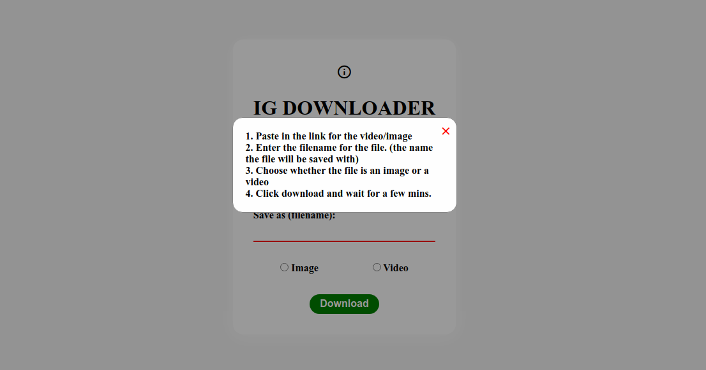

# ig-downloader
Flask web app for downloading instagram videos and images

### Screenshot of the Running App 

### App Help Menu 

## To run the app on your local machine:
- Fork and clone this repository.
- Create a virtual environment and activate it.

  * On Windows:
    ```bash
    python3 -m venv downloader-env

    ./downloader-env/Scripts/activate
    ```
  
  * On Linux:
    ```bash
    python3 -m venv downloader-env

    source ./downloader-env/bin/activate
    ```
  
- Install the dependencies using pip:
  ```bash
  pip install -r requirements.txt
  ```
- Install a web driver that matches your Google Chrome version and modify the code to point to its path. 
- Run the flask app using `python app.py` or `python3 app.py` or `flask run` or `FLASK_APP=app.py FLASK_ENV=development flask run`
